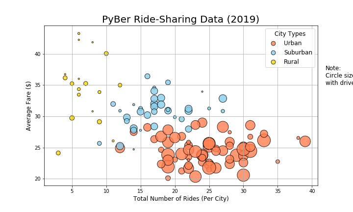
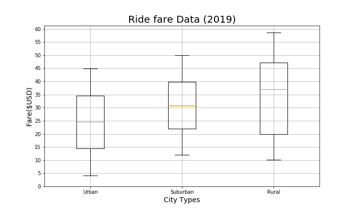
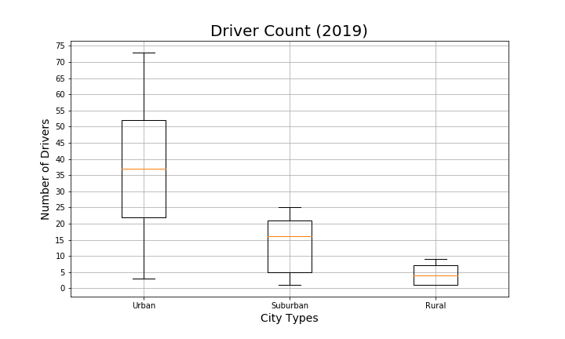
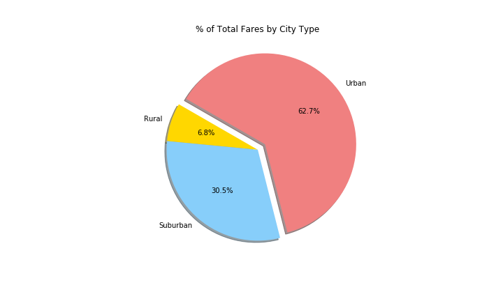
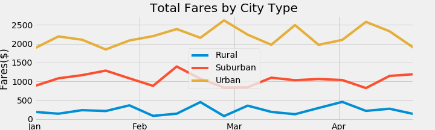
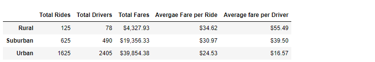

# Pyber_Analysis

## Project Overview
We've been tasked by Pyber, Python-based ride sharing app company, to analyse their data, and create a compelling visualization showing correlations between city types, number of rides, number of riders, and fares.

## Resources
- Data Source: city_data.csv and Pyber_ride_data.csv
- Software: Python 3.7.6, Anaconda 4.8.3, Jupyter Notebook, Pandas and Matplotlib.pyplot libraries

## Summary
We created these different graphs.
- Bubble Chart showing corrrelations between Fares and Number of Rides per City Type and Driver Count

- Box-and-whisker plots showing correlations between Rides Count / Drivers Count / Total fares and City Type

- Pie charts showing correlations between Percenatge of Total fares and Total Drivers by City Type

## Challenge Overview
We've been tasked with creatimg a Summary DataFrame with all the key metrics of the ride-sharing data by city type, and a multi-line graph showing the aveage fare for each week in specific time-period by each city type.

## Challenge Summary
We created the Summary DataFrame showing the Total Rides, Drivers, Fares count, and the average fares per ride and per driver.
There are 12 and 3 times more Rides in Urban areas than in Suburbans and Rural areas, and 5 and 30 times more drivers - but it seems that some registered drivers have not been driving in Urban areas during that time. Urban areas bring 2 and 5 times more fares than Suburban and Rural areas. The averages per ride are not as different - the Rural average is only 1.1 and 1.5 higher than the Suburban and Urban average, but the Rural average per driver is 1.4 andf 3.5 higher than the Suburban and Urban ones.

We created a multi-line graph showing the Total fares by City Type per week between January and April 2019.
- Per each type, the lines follow a similar tendency but with time shifts. 
- In general, when the Urban areas feel a surge, Rural and Suburban areas get a dip - and vice versa.

