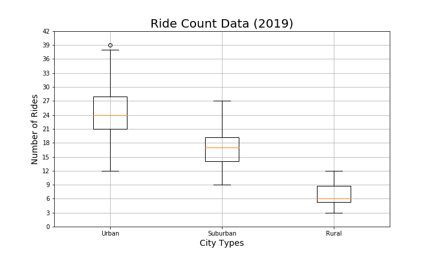

# Pyber_Analysis

## Project Overview
We've been tasked by Pyber, Python-based ride sharing app company, to analyse their data, and create a compelling visualization showing correlations between city types, number of rides, number of riders, and fares.

## Resources
- Data Source: city_data.csv and Pyber_ride_data.csv
- Software: Python 3.7.6, Anaconda 4.8.3, Jupyter Notebook, Pandas and Matplotlib.pyplot libraries

## Summary
We created these different graphs.
- Bubble Chart showing corrrelations between Fares and Number of Rides per City Type and Driver Count

- Box-and-whisker plots showing correlations between Rides Count / Drivers Count / Total fares and City Type

- Pie charts showing correlations between Percenatge of Total fares and Total Drivers by City Type

